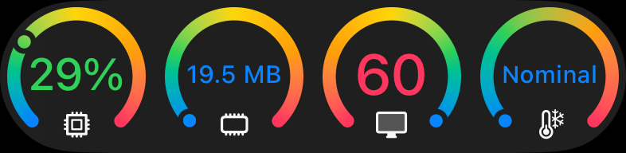
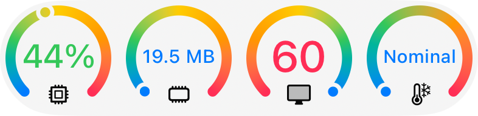

# Performance Monitor
  

# Preview

<picture>
  <source media="(prefers-color-scheme: dark)" srcset="./preview/dark.png">
  
</picture>
<picture>
  <source media="(prefers-color-scheme: light)" srcset="./preview/light.png">
  
</picture>

## Usage

```swift
import PerformanceMonitor

// add it somewhere inside your root most SwiftUI View.
@State isPresented: Bool = false
var body: some View {
    NavigationStack {
        ...
    }
    .performanceMonitor(
        isPresented: $isPresented,
        shakeGestureTogglesPresentation: true,
        sizeClass: .compact
    )
}

// if you want to toggle it's presentation via button for example
PerformanceMonitor.shared.togglePresentation()  
```
Or just shake your iOS device from side to side, if you didn't pass `false` to `shakeGestureTogglesPresentation`.


## Installation

### [Swift Package Manager](https://swift.org/package-manager/)

```swift
dependencies: [
    .package(url: "https://github.com/IgorMuzyka/PerformanceMonitor", .upToNextMajor(from: "1.0.0")),
]
```

## Acknowledgements

This project was heavily inspired by this [GDPerformanceView-Swift](https://github.com/dani-gavrilov/GDPerformanceView-Swift).
